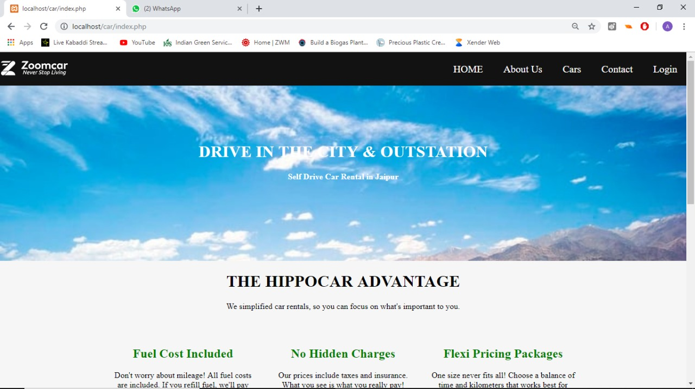
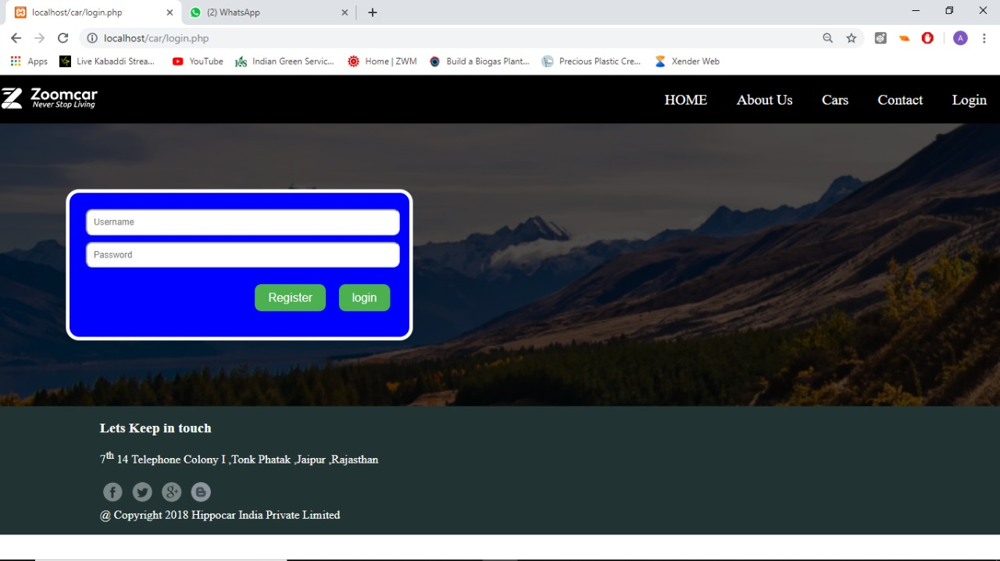
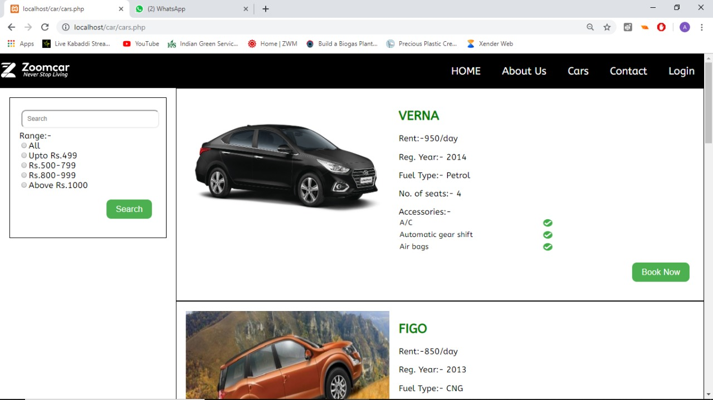
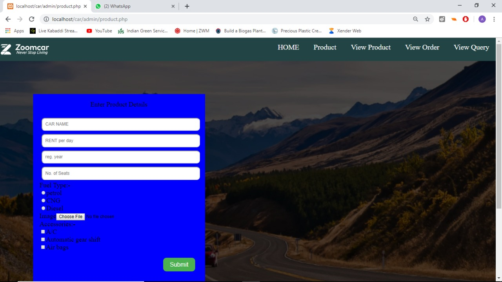
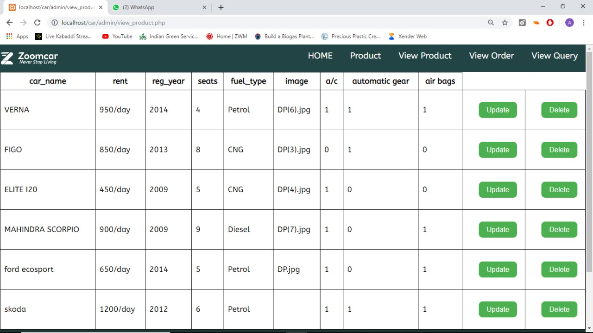
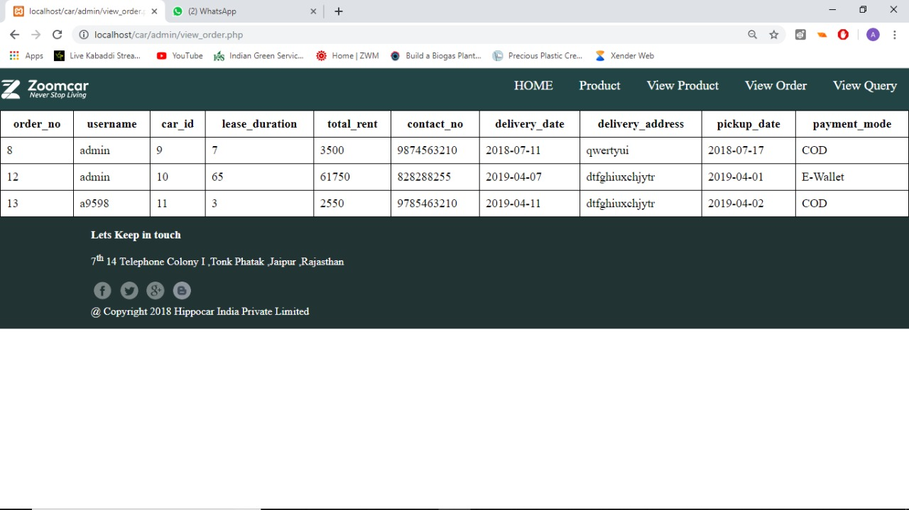
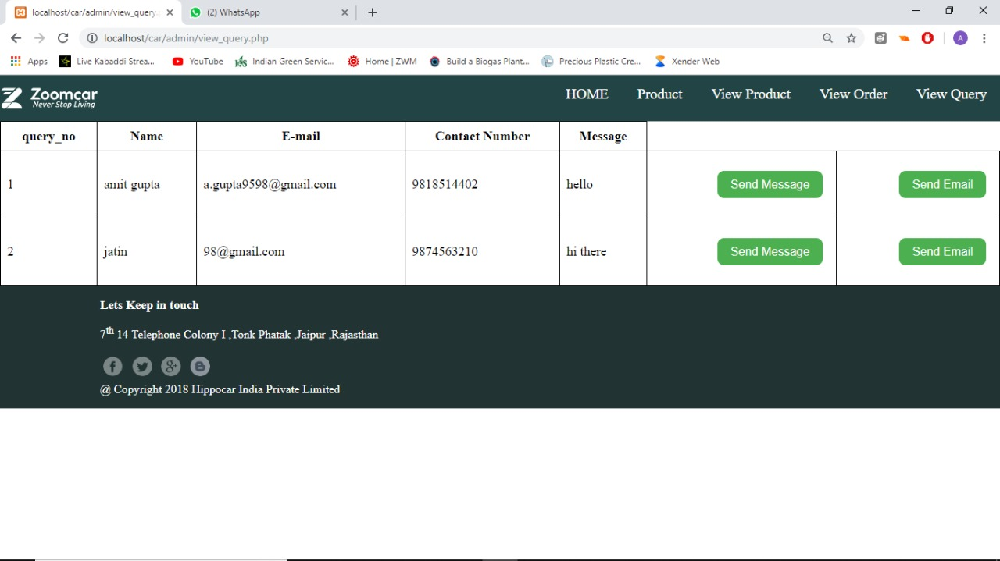

# ZOOM CAR - CAR RENTAL WEBSITE

Zoomcar is a car rental webapplication based on php. here you can rent a car from a wide range of available cars.

## TECHNICAL DESCRIPTION-

This WebApp is based on php. Here i have used HTML, and CSS to create a user interface. For database I have used MySQL. I have written all the CSS code by scrach insted of using any library files.

This project also included the admin panel, through which the admin can have the whole control over the website. The Admin can add, remove, update the cars and will have control over whole database.

## SCREENSHOTS -

### HOME PAGE :

### LOGIN :

### RENTAL PAGES :

### ADMIN PANEL :

#### ADD CAR -

#### Update Car Info -

#### Custom Feedback / Query -

#### Customer Details -

